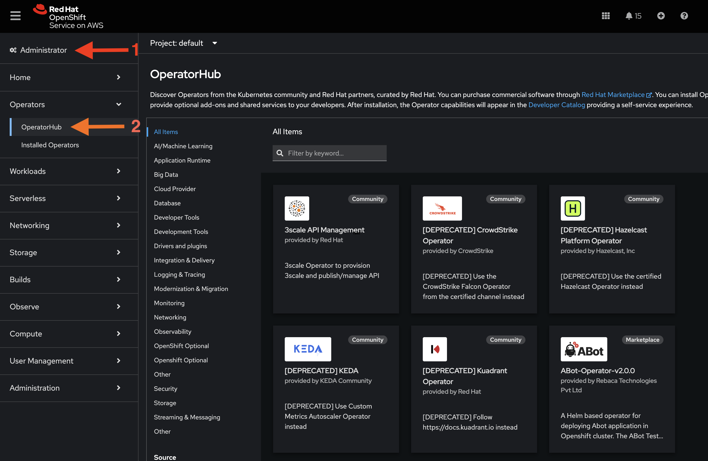
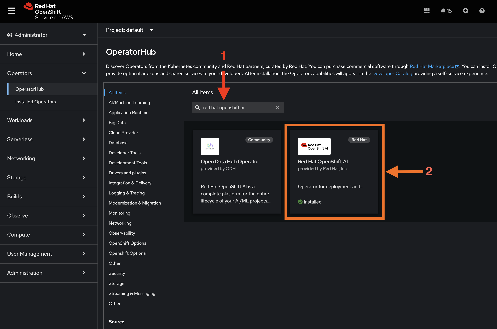
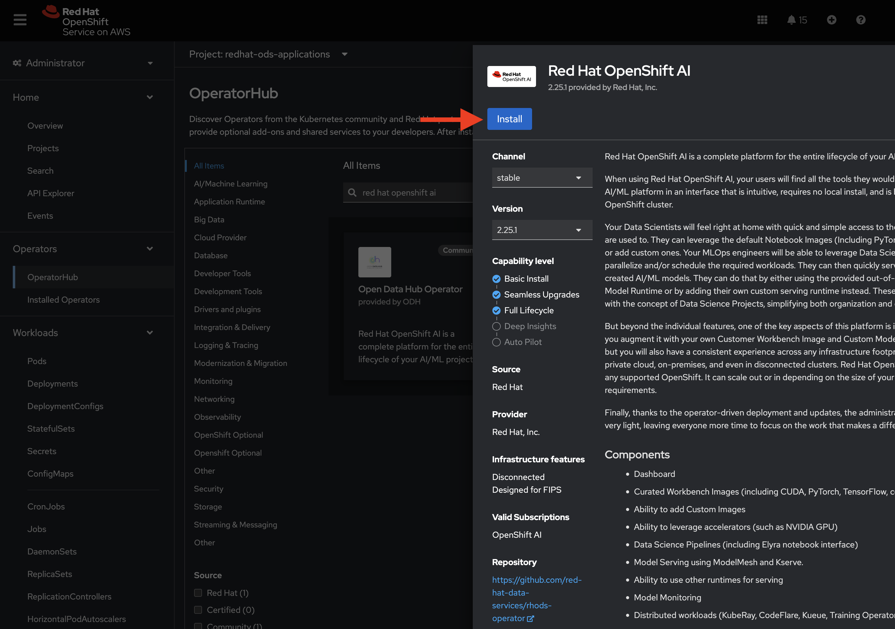
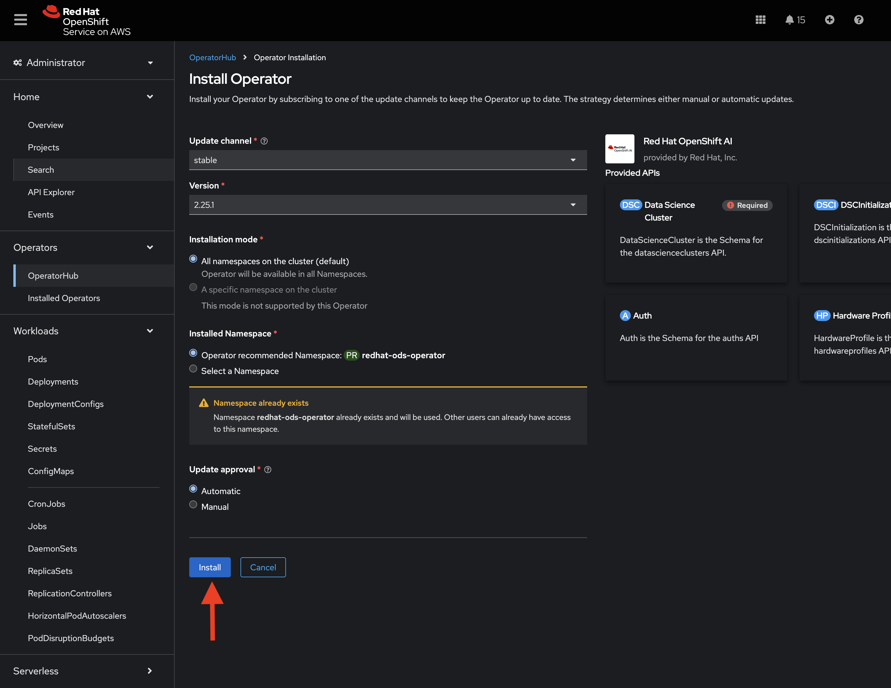
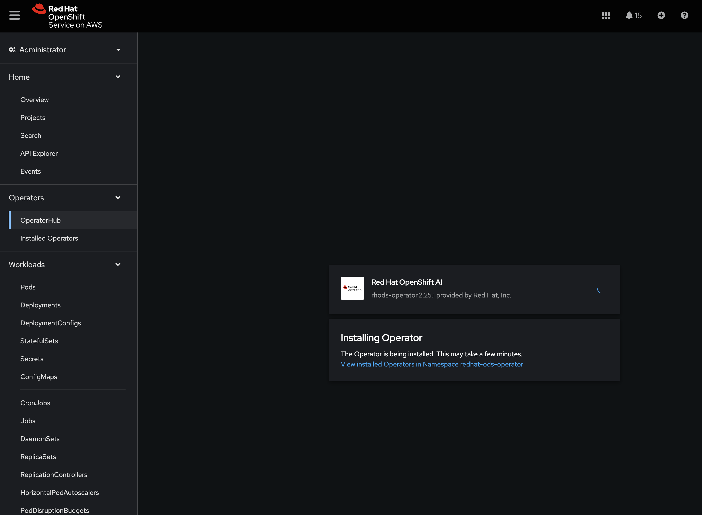
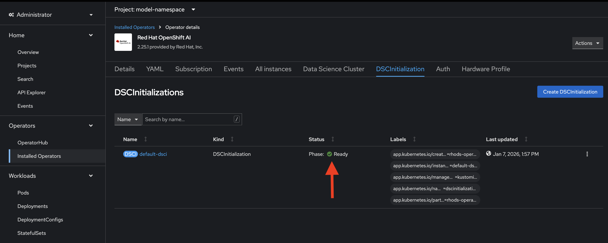
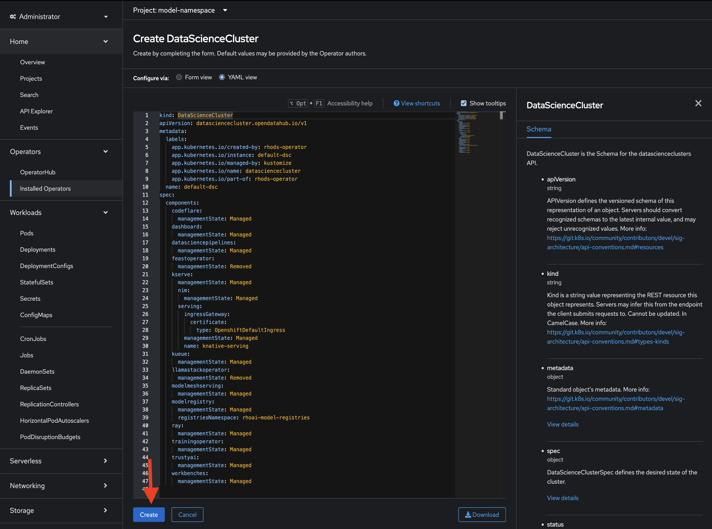
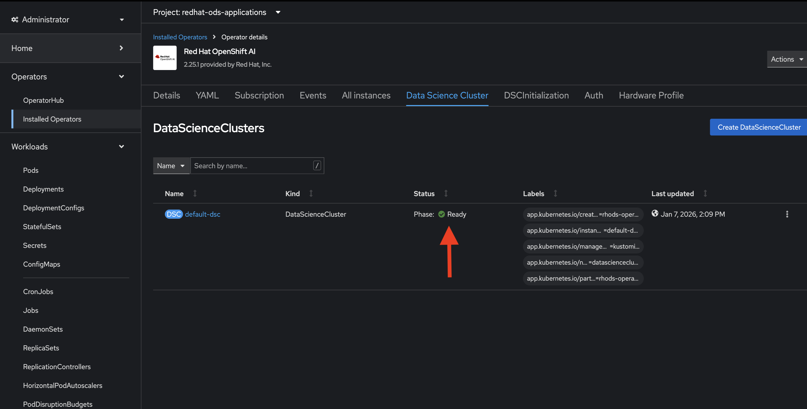
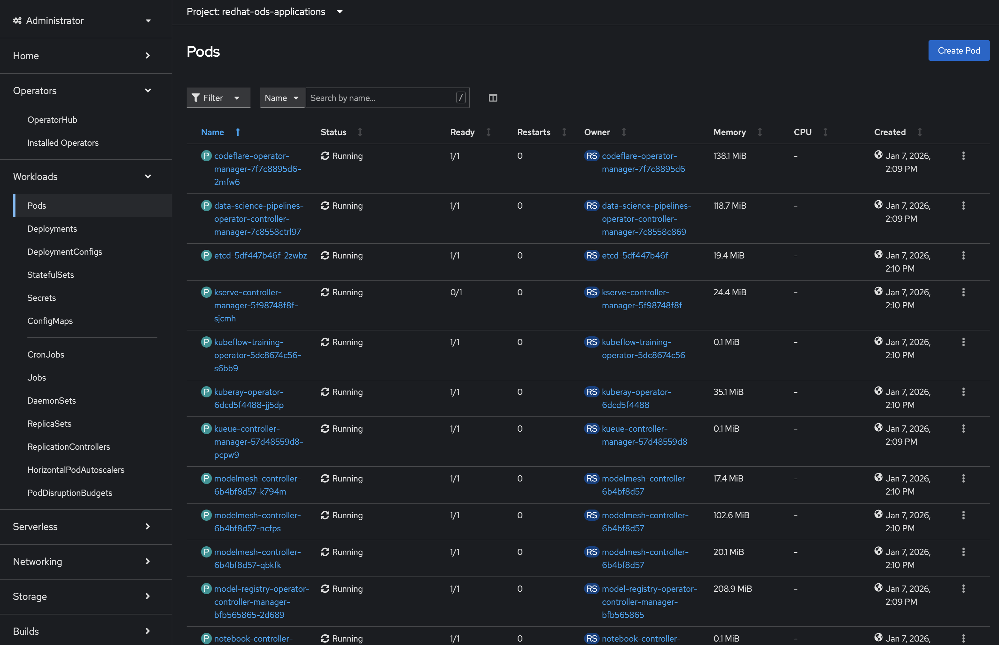
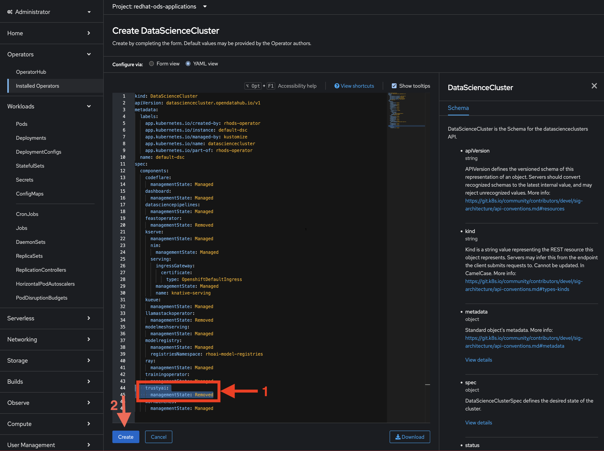

# Install Prequisite Operators
The default installation of each of these operators is all we need:
1) Red Hat OpenShift Serverless
2) Red Hat OpenShift Service Mesh *2*

---
# Installing RHOAI
1) From your OpenShift console, switch to Administrator view, then navigate to Operators -> OperatorHub: 
2) Search for "Red Hat OpenShift AI", then click on the Red Hat Openshift AI operator: 
3) Click `Install`:

4) Click `Install` again:

5) Wait for the operator to install:

6) Once the operator is installed, navigate to `Installed Operators` -> `Red Hat Openshift AI` -> `DSCInitialization`, and verify that the DSCI is ready:


---
# Deploy Openshift AI
## With the default TrustyAI
If you want to use the version of TrustyAI that came bundled in the RHOAI release, follow these steps:

1) Navigate to `Installed Operators` -> `Red Hat Openshift AI` -> `Data Science Cluster`, then hit `Create Data Science Cluster`, then `Create:



2) Wait for the Data Science Cluster to become ready:


Alternatively, you can watch the pods spin up in the `redhat-ods-applications` project:


Once the DSC reports that it's ready (or all the pods are up and running), you're good to go!

## With Upstream TrustyAI
If you want to use a custom version of TrustyAI, e.g., the latest upstream TrustyAI, follow these steps:

1) Navigate to `Installed Operators` -> `Red Hat Openshift AI` -> `Data Science Cluster`, then hit `Create Data Science Cluster`:

2) From the DSC configuration page, set TrustyAI to `Removed`, then hit `Create`:

3) Clone the TrustyAI Service Operator repo: `git clone https://github.com/trustyai-explainability/trustyai-service-operator`
4) Navigate into the `trustyai-service-operator` repo, and build the TrustyAI Operator manifests: 
```
make manifest-gen NAMESPACE=redhat-ods-applications KUSTOMIZE=kustomize
```
The above command will use the latest, upstream TrustyAI operator. To use a custom version of the TrustyAI operator image, you can run:
```
make manifest-gen NAMESPACE=redhat-ods-applications KUSTOMIZE=kustomize OPERATOR_IMAGE=$YOUR_TRUSTYAI_OPERATOR_IMAGE 
```
5) A file will be created in `trustyai-service-operator/release/trustyai_bundle.yaml`
6) Install the TrustyAI operator: 
```
oc apply -f release/trustyai_bundle.yaml -n redhat-ods-applications
```
7) Wait for the TrustyAI operator pod to spin up in the `redhat-ods-applications` project.