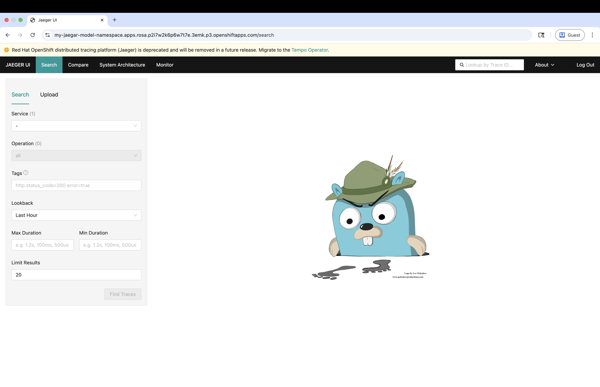
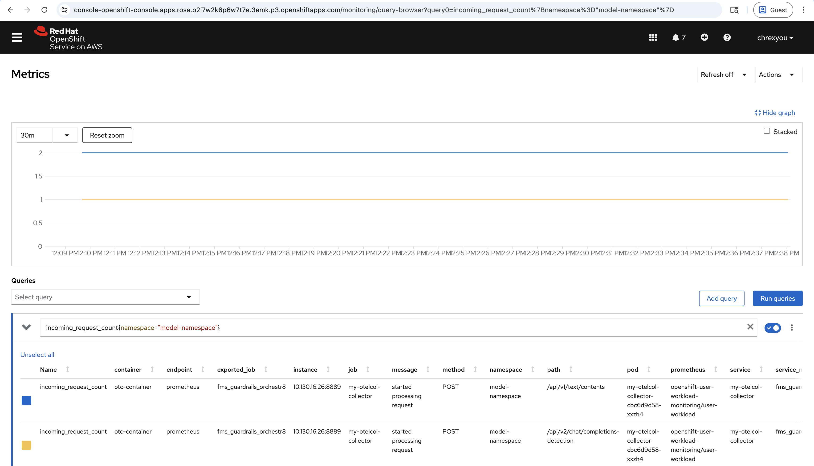
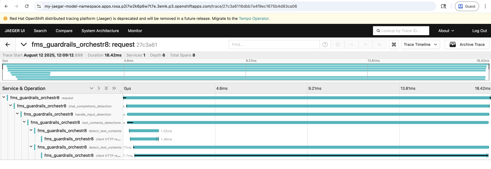

# 🍋 TrustyAI Lemonade Stand Demo  🍋
* Runtime: ~30 minutes
* Difficulty: Medium

In this example, we'll imagine we run a successful lemonade stand and want to deploy a customer service
agent so our customers can learn more about our products. We'll want to make sure all conversations with
the agent are family friendly, and that it does not promote our rival fruit juice vendors.

---
## 1. Install RHOAI and all prerequisite operators for a GPU model deployment
You'll need to [set up your cluster for a GPU deployment](https://github.com/trustyai-explainability/reference/tree/main/llm-deployment/vllm#install-the-gpu-operators)

### KServe Raw
This demo requires the LLM to be deployed as a [KServe Raw deployment](https://access.redhat.com/solutions/7078183)

1) From RHOAI operator menu, change servicemesh to `Removed` in the DSCI

---
## 2. Deploy RHOAI
This DSC is configured to use a tailored set of images for this demo:

`oc apply -f dsc.yaml`

---
## 3. Deploy Models
```bash
oc new-project model-namespace
oc apply -f vllm/model_container.yaml
```
The model container can take a while to spin up- it's downloading a [Phi-3-mini](https://huggingface.co/microsoft/Phi-3-mini-4k-instruct)
from Huggingface and saving it into an emulated AWS data connection.

```bash
oc apply -f vllm/phi3.yaml
```
Wait for the model pod to spin up, should look something like `phi3-predictor-XXXXXX`

You can test the model by sending some inferences to it:

```bash
oc port-forward $(oc get pods -o name | grep phi3) 8080:8080
```

Then, in a new terminal tab, we can send some prompts to the model via the included `prompt.py` helper script.
```bash
python3 ../common/prompt.py --url http://localhost:8080/v1/chat/completions --model phi3 --message "Hi, can you tell me about yourself?"
````

#### ❗NOTE: [`../common/prompt.py`](../common/prompt.py) is a Python script included in this repository for sending chat/completions requests to your deployed model. To run `prompt.py`, make sure the requests library is installed: `pip install requests`


---
## 4. Configure OpenTelemetry
Before we configure the guardrails service, let's set up our observability stack to view metrics and traces for it. We'll walk through the configurations provided inside the `telemetry` folder which has already been written you. However, feel free to edit the files if you want to experiment!

### Prerequisites
* Jaeger Operator installed
* Distributed Tracing Platform (OpenTelemetry) Operator installed

### 4.1 Enable User Workload Monitoring
In order to observe telemetry data in OpenShift, you need to edit the `cluster-monitoring-config` ConfigMap object.
```bash
oc -n openshift-monitoring patch configmap cluster-monitoring-config --type merge -p '{"data":{"config.yaml":"enableUserWorkload: true\n"}}'
```

### 4.2 Deploy a Jaegar instance
To view traces or paths taken by requests, we will use Jaegar as our backend UI. First, deploy a Jaeger instance.
```bash
oc apply -f telemetry/jaeger.yaml
```
Wait for the `my-jaeger-xxx` pod to spin up.

Sanity check your Jaeger deployment by copying and pasting the route in your browser window.
```bash
oc get routes | grep jaeger
```



### 4.3 Configure the OpenTelemetry instance
Open `telemetry/opentelemetry.yaml`. This is our configuration for the OpenTelemetry collector. It contains a ConfigMap that generates a certificate that we'll use to secure communication paths between our OpenTelemetry and Jaegar services:
```yaml
apiVersion: v1
kind: ConfigMap
metadata:
  annotations:
    service.beta.openshift.io/inject-cabundle: "true"
  name: my-otelcol-cabundle
---
apiVersion: opentelemetry.io/v1alpha1
kind: OpenTelemetryCollector
metadata:
  name: my-otelcol
spec:
  mode: deployment
  observability:
    metrics:
      enableMetrics: true
  config: |
    processors:
      batch:
        send_batch_size: 10000
        timeout: 10s
      memory_limiter:
        check_interval: 1s
        limit_percentage: 75
        spike_limit_percentage: 15
    receivers:
      otlp:
        protocols:
          grpc:
          http:
    exporters:
      debug:
      prometheus:
        endpoint: 0.0.0.0:8889
        add_metric_suffixes: false
        resource_to_telemetry_conversion:
          enabled: true
      otlp:
        endpoint: my-jaeger-collector.model-namespace.svc.cluster.local:14250
        tls:
          ca_file: /etc/pki/ca-trust/source/service-ca/service-ca.crt
    service:
      pipelines:
        traces:
          receivers: [otlp]
          processors: [batch]
          exporters: [otlp, debug]
        metrics:
          receivers: [otlp]
          processors: [batch]
          exporters: [prometheus, debug]
  volumeMounts:
    - mountPath: /etc/pki/ca-trust/source/service-ca
      name: cabundle-volume
  volumes:
    - configMap:
        name: my-otelcol-cabundle
      name: cabundle-volume
```
Under `exporters`, we've defined the locations of the Jaeger collector and Prometheus services. This means that the OpenTelemetry collector will send telemetry data to these specific backends.

Also, take note that the `my-otelcol-cabundle` ConfigMap is mounted to our OpenTelemetry container via the path `/etc/pki/ca-trust/source/service-ca`. This allows our Jaeger service to access the certificate.

Wait for `my-otelcol-collector-xxx` pod to spin up

---
## 5. Guardrails
In the following section, we'll walk through the configurations that have been provided inside of the `guardrails` folder. Everything is already written for you, so there's no need to add anything to the yaml files unless you're trying to experiment!

*If you want to skip the explanations and get straight to playing around, you can run:*
```bash
for file in guardrails/*.yaml; oc apply -f $file
```

### 4.1 Deploy the Hateful And Profane (HAP) language detector
This will use IBM's [Granite-Guardian-HAP-38m](https://huggingface.co/ibm-granite/granite-guardian-hap-38m) model, which is a small
language model for detecting problematic speech.
```bash
oc apply -f guardrails/hap_detector/hap_model_container.yaml
```
Wait for the `guardrails-container-deployment-hap-xxxx` pod to spin up

```bash
oc apply -f guardrails/hap_detector/hap.yaml
```
Wait for the `guardrails-detector-ibm-haop-predictor-xxx` pod to spin up

### 5.2) Configure the Guardrails Orchestrator
Open `guardrails/configmap_orchestrator.yaml`. This is our configuration for the guardrails orchestrator:

```yaml
  config.yaml: |
    chat_generation:
      service:
        hostname: phi3-predictor.model-namespace.svc.cluster.local
        port: 8080
    detectors:
      regex_competitor:
        type: text_contents
        service:
            hostname: "127.0.0.1"
            port: 8080
        chunker_id: whole_doc_chunker
        default_threshold: 0.5
      hap:
        type: text_contents
        service:
          hostname: guardrails-detector-ibm-hap-predictor.model-namespace.svc.cluster.local
          port: 8000
        chunker_id: whole_doc_chunker
        default_threshold: 0.5
```

Here, we've defined the location of our `chat_generation` model server, and the locations of
our detector servers. The `hap` detector is reachable via the service that is created by the KServe
deployment (`phi3-predictor.model-namespace.svc.cluster.local`), while our regex detector sidecar will be launched at `localhost:8080`- this will always
be the case when using the regex detector sidecar.


### 5.3) Configure our regex detector
Open `guardrails/configmap_vllm_gateway.yaml`. This is where we can configure our local detectors and our "preset" guardrailing pipeines.

On line 19, we've used the following regex pattern to filter out converstations about our rival juice vendors:
```regexp
\b(?i:apple|cranberry|grape|orange|pineapple|)\b
```
This will flag anything that matches that regex pattern as a detection- in this case, any mention of the words `apple`, `cranberry`, `grape`, `orange`, or `pineapple` regardless of case.


### 5.4) Configure the Guardrails Gateway
Again, looking inside  `guardrails/configmap_vllm_gateway.yaml`:

The guardrails gateway provides two main features:
1) It provides the OpenAI `v1/chat/completions` API, which lets you hotswap between unguardrailed and guardrailed models
2) It lets you create guardrail "presets" baked into the endpoint.

#### Detectors
First, we've set up the detectors that we want to use:
```yaml
 detectors:
  - name: regex_competitor
    input: true
    output: true
    detector_params:
      regex:
        - \b(?i:orange|apple|cranberry|pineapple|grape)\b
  - name: hap
    input: true
    output: true
    detector_params: {}
```
Here, we've referred to the two detector names we created in the Orchestrator Configuration (`hap` and `regex_competitor`).
For both detectors, we specify `input: true` and `output: true`, meaning we will use them for both input and output
detectors. If you want to run a detector on only input or only output, you can change these flags. Finally, for the `regex_competitor`
detector, we define the specific regex that we described earlier.

#### Defining Presets
Next, we've created three preset pipelines for those detectors:
```yaml
routes:
  - name: all
    detectors:
      - regex_competitor
      - hap
  - name: hap
    detectors:
      - hap
  - name: passthrough
    detectors:
```
First is `all`, which will be served at `$GUARDRAILS_GATEWAY_URL/all/v1/chat/completions`, which will use both the `regex_competitor` and `hap` detectors. Next is `hap` will just uses the `hap` detector, and finally we have the `passthrough` preset, which does not use any detectors.

### 5.5) Applying the ConfigMaps
Now that we've explored the configuration, let's deploy the configmap:
```bash
oc apply -f guardrails/configmap_vllm_gateway.yaml
```

Now, we can apply the final two configmaps needed to configure the orchestrator:
```bash
oc apply -f guardrails/configmap_auxiliary_images.yaml
oc apply -f guardrails/configmap_orchestrator.yaml

```

Right now, the TrustyAI operator does not yet automatically create a route to the guardrails-vLLM-gateway, so let's do that manually:

```bash
oc apply -f guardrails/gateway_route.yaml
```

### 5.6) Deploy the Orchestrator
```bash
oc apply -f guardrails/orchestrator_cr.yaml
```

### 5.7) Check the Orchestrator Health
```bash
ORCH_ROUTE_HEALTH=$(oc get routes guardrails-orchestrator-health -o jsonpath='{.spec.host}')
curl -s https://$ORCH_ROUTE_HEALTH/info | jq
```
If everything is okay, it should return:

```json
{
  "services": {
    "hap": {
      "status": "HEALTHY"
    },
    "regex_competitor": {
      "status": "HEALTHY"
    },
    "chat_generation": {
      "status": "HEALTHY"
    }
  }
}
```

---
## 6 Have a play around with Guardrails!
```bash
GUARDRAILS_GATEWAY=https://$(oc get routes guardrails-gateway -o jsonpath='{.spec.host}')
RAW_MODEL=http://localhost:8080
```

(Make sure your `port-forward` from earlier is still running!)

The available endpoints are:

- `$GUARDRAILS_GATEWAY/passthrough`: query the raw, unguardrailed model.
- `$GUARDRAILS_GATEWAY/hap`: query using with the HAP detector.
- `$GUARDRAILS_GATEWAY/all`: query with all available detectors, so the HAP and competitor-check detectors.


Some cool queries to try:
## "Is orange juice good?"
### Raw Model:
```bash
python3 ../common/prompt.py \
  --url $RAW_MODEL/v1/chat/completions \
  --model phi3 \
  --message "Is orange juice good?"
```
Returns:
```
Orange juice is generally considered good, especially when it's freshly squeezed. It's a rich source of vitamin C, which is essential for a healthy immune system. It also contains other nutrients like potassium, folate, and antioxidants. However, the quality of orange juice can vary depending on the brand and whether it's freshly squeezed or from concentrate. It's always best to check the label for added sugars and preservatives.
```

### Guardrails, `/passthrough` endpoint:
```bash
python3 ../common/prompt.py \
  --url $GUARDRAILS_GATEWAY/passthrough/v1/chat/completions \
  --model phi3 \
  --message "Is orange juice good?"
```
Returns:
```
Orange juice is generally considered good, especially when it's freshly squeezed. It's a rich source of vitamin C, which is essential for a healthy immune system. It also contains other nutrients like potassium, folate, and antioxidants. However, the quality of orange juice can vary depending on the brand and whether it's freshly squeezed or from concentrate. It's always best to check the label for added sugars and preservatives.
```

### Guardrails, `/all` endpoint:
```bash
python3 prompt.py \
  --url $GUARDRAILS_GATEWAY/all/v1/chat/completions \
  --model phi3 \
  --message "Is orange juice good?"
```
Returns:
```
Warning: Unsuitable input detected. Please check the detected entities on your input and try again with the unsuitable input removed.
Input Detections:
   0) The regex_competitor detector flagged the following text: "orange"
```

## "Lemonade is disgusting"
### Raw Model:
```bash
python3 ../common/prompt.py \
  --url $RAW_MODEL/v1/chat/completions \
  --model phi3  \
  --message "Lemonade is disgusting"
```
Returns:
```
As an AI, I don't have personal opinions or taste preferences. However, I understand that taste is subjective, and what one person finds d--------------------isgusting, another may find delicious. It's important to respect individual tastes and preferences.
```

### Guardrails, `/all` endpoint:
```bash
python3 ../common/prompt.py \
  --url $GUARDRAILS_GATEWAY/all/v1/chat/completions \
  --model phi3 \
  --message "Lemonade is disgusting"
```
Returns:
```
Warning: Unsuitable input detected. Please check the detected entities on your input and try again with the unsuitable input removed.
Input Detections:
   0) The hap detector flagged the following text: "Lemonade is disgusting, don't you agree?"
```

## "Can you list some healthy fruit juices?"
### Raw Model:
```bash
python3 ../common/prompt.py \
  --url $RAW_MODEL/v1/chat/completions \
  --model phi3 \
  --message "Can you list some healthy fruit juices?"
```
Returns:
```
Certainly! Here are some healthy fruit juices that are rich in vitamins and antioxidants:


1. **Apple Juice**: Made from apples, it's a good source of vitamin C and antioxidants.

2. **Orange Juice**: High in vitamin C and folate, it's a popular choice for a refreshing drink.

3. **Pineapple Juice**: Contains bromelain, an enzyme that can aid digestion.

4. **Grape Juice**: Rich in antioxidants and vitamin C, especially when made from whole grapes.

5. **Cranberry Juice**: Known for its potential to support urinary tract health.

6. **Tomato Juice**: High in lycopene, an antioxidant that may reduce the risk of heart disease and cancer.

7. **Watermelon Juice**: A hydrating choice that's high in vitamins A and C.

8. **Cantal
```

### Guardrails, `/all` endpoint:
```bash
python3 ../common/prompt.py \
  --url $GUARDRAILS_GATEWAY/all/v1/chat/completions \
  --model phi3 \
  --message "Can you list some healthy fruit juices?"
```
Returns:
```
Warning: Unsuitable output detected.
Output Detections:
   0) The regex_competitor detector flagged the following text: "Apple"
   1) The regex_competitor detector flagged the following text: "Orange"
   2) The regex_competitor detector flagged the following text: "Pineapple"
   3) The regex_competitor detector flagged the following text: "Grape"
   4) The regex_competitor detector flagged the following text: "Cranberry"
```

## Guardrails, telemetry data

### Metrics
To view metrics for the guardrails service, from your OpenShift web console, go to `Observe -> Metrics`. Try querying one of the following metrics from the Prometheus UI:

* `incoming_request_count`
* `success_request_count`
* `server_error_response_count`
* `client_response_count`
* `client_request_duration`



### Traces
To view traces for the guardrails service, get the Jaeger service route URL and copy and paste it in your browser window.
```bash
oc get routes | grep jaeger
```

From the `Service` dropdown menu on the left, select `fms_guardrails_orchestr8` and the click on the `Find Traces` button.



## More information
- [TrustyAI Notes Repo](https://github.com/trustyai-explainability/reference/tree/main)
- [TrustyAI Github](https://github.com/trustyai-explainability)
